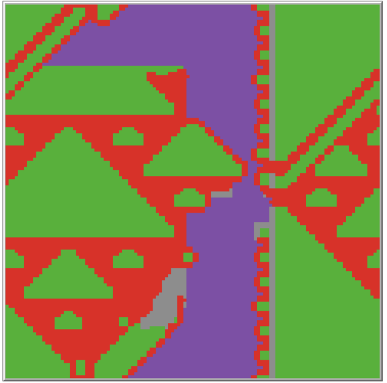

# Iterated-Prisoners-Dilemma-Simulation

This project simulates the **Iterated Prisoner's Dilemma** using **NetLogo**, where each patch (grid cell) represents an agent using a specific strategy. Agents play against their 8 neighbors over multiple rounds, evolving their strategies based on performance.

---

## 🧠 How It Works

- Each patch is initialized with a strategy based on configuration parameters.
- In every round, each patch plays the Prisoner’s Dilemma against its 8 surrounding patches.
- After a configurable number of rounds:
  - Each patch adopts the strategy of the **highest-scoring neighbor**.
- Strategies are color-coded (refer to the code for mapping).

This setup allows **spatial strategy evolution**, making it possible to observe complex emergent patterns such as **Sierpiński Carpet-like fractals** under the right conditions.

---

## 🎮 How to Use

1. Open `Iterated prisoners dilemma.nlogo` in NetLogo.
2. Adjust the parameters to control:
   - Number of rounds per evaluation cycle
   - Initial distribution of strategies
   - Mutation/noise levels
   - Payoff matrix values
3. Press `SETUP` to initialize the environment.
4. Press `GO` to start the simulation.

> ⚠️ After pressing `SETUP`, the visualization may not update until `GO` is pressed. Slightly adjusting a slider can also trigger a screen refresh.

---

## 🧪 Things to Try

- Vary payoff values to observe how cooperation or defection spreads.
- Introduce small noise and observe resilience of strategy clusters.
- Try parameter combinations that **generate Sierpiński Carpet patterns** like in the provided snapshot — a classic emergent structure in this model.

---

## 📁 Repository Contents

| File | Description |
|------|-------------|
| `Iterated prisoners dilemma.nlogo` | NetLogo simulation model |
| `Snapshot_Sierpiński_Carpet.png` | Example output (fractal-like pattern) |
| `raw_code` | Source reference (not used directly by NetLogo) |

---

## 👥 Credits

Created by:
- Tobias Spilker  
- Stijn van Huët  

*Utrecht University*

---

## 📄 License

No license specified. Educational use permitted unless otherwise stated.

---
